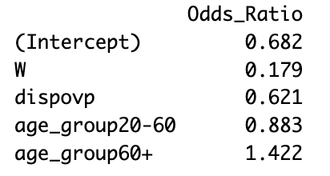
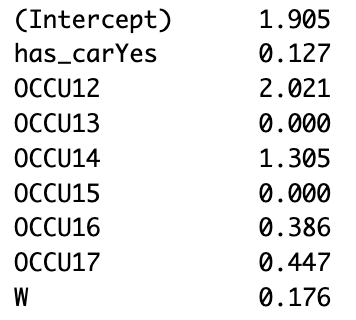

```{r load-data, include=FALSE}
load("allgreI_filtered.RData")
load("allgreI_with_W.RData")
load("allgreI_with_new_vars.RData")


```


```{r, include=FALSE}
library(ggplot2)     # For data visualization
library(dplyr)       # For data manipulation (e.g., mutate, rename)
library(tidyr)       # For data tidying (e.g., handling missing values)
library(skimr) 
```


```{r, include=FALSE}
logit_model1 <- glm(immobil ~ dispovp + age_group, data = allgreI_filtered, family = binomial)
summary(logit_model1)
```

```{r, include=FALSE}
logit_model2 <- glm(immobil ~ W, data = allgreI_filtered, family = binomial)
summary(logit_model2)
```

```{r, include=FALSE}
# Lijst met alle variabelen voor aparte logistische modellen
variables <- c("dispovp", "age_group", "sexe", "cspgroup", "has_car", 
               "TYPE_HAB", "parking_diff", "OCCU1", "travdom", "nb_pers", "W")

# Loop door elke variabele en maak een apart logistisch model
for (var in variables) {
  # Dynamische naam voor het model
  model_name <- paste0("logit_model_", var)
  
  # Formule voor het model
  formula <- as.formula(paste("immobil ~", var))
  
  # Bouw het logistisch regressiemodel
  assign(model_name, glm(formula, data = allgreI_filtered, family = binomial))
  
  # Optioneel: toon de samenvatting van elk model
  cat("\n\n Samenvatting van", model_name, ":\n")
  print(summary(get(model_name)))
}

```
\tiny
```{r, echo=FALSE}
# Logistisch regressiemodel
logit_model2 <- glm(immobil ~ W + dispovp + age_group, data = allgreI_filtered, family = binomial)
summary(logit_model2)

```
{width=30%}


```{r, include=FALSE}
logit_model3 <- glm(immobil ~ dispovp + age_group + sexe + cspgroup+ has_car + TYPE_HAB + parking_diff + OCCU1  + nb_pers + W  , data = allgreI_filtered, family = binomial)
summary(logit_model3)
```


```{r, include=FALSE}
logit_model4 <- glm(immobil ~ dispovp + age_group + cspgroup+ has_car + TYPE_HAB + parking_diff + OCCU1 + nb_pers + W , data = allgreI_filtered, family = binomial)
summary(logit_model4)
```
```{r, include=FALSE}
logit_model5 <- glm(immobil ~ dispovp + age_group + cspgroup+ has_car + parking_diff + OCCU1 + nb_pers + W , data = allgreI_filtered, family = binomial)
summary(logit_model5)
```
```{r, include=FALSE}
logit_model6 <- glm(immobil ~ dispovp + age_group + cspgroup+ has_car + parking_diff + OCCU1 + W , data = allgreI_filtered, family = binomial)
summary(logit_model6)
```
```{r, include=FALSE}
logit_model7 <- glm(immobil ~ age_group + cspgroup+ has_car + parking_diff + OCCU1 + W , data = allgreI_filtered, family = binomial)
summary(logit_model7)
```
```{r, include=FALSE}
logit_model8 <- glm(immobil ~ age_group + has_car + parking_diff + OCCU1 + travdom + W , data = allgreI_filtered, family = binomial)
summary(logit_model8)
```
```{r, include=FALSE}
logit_model9 <- glm(immobil ~ has_car + parking_diff + OCCU1 + travdom + W , data = allgreI_filtered, family = binomial)
summary(logit_model9)
# Verwijder niet-significante OCCU1 categorieën
allgreI_filtered <- allgreI_filtered %>%
  filter(!OCCU1 %in% c("3-5", "8", "9"))

```


\tiny
```{r, echo=FALSE}
logit_model9 <- glm(immobil ~ has_car + OCCU1 + W , data = allgreI_filtered, family = binomial)
summary(logit_model9)


```

{width=25%}


```{r, include=FALSE}
library(caTools)
library(pROC)
library(dplyr)

set.seed(123)  # Voor reproduceerbaarheid

# 1️ Controleer ontbrekende waarden in de relevante variabelen
na_summary <- sapply(allgreI_filtered[, c("immobil", "has_car", "OCCU1", "W")], function(x) sum(is.na(x)))
print(na_summary)

# 2️ Verwijder rijen met NA's in de gebruikte variabelen (of gebruik imputatie)
clean_data <- allgreI_filtered %>%
  filter(!is.na(immobil) & !is.na(has_car) & !is.na(OCCU1) & !is.na(W))

cat("Aantal observaties na opschonen:", nrow(clean_data), "\n")

# 3️ 80% Train - 20% Test split op de opgeschoonde dataset
split <- sample.split(clean_data$immobil, SplitRatio = 0.8)
train_data <- subset(clean_data, split == TRUE)
test_data <- subset(clean_data, split == FALSE)

# 4️ Zorg dat de levels van OCCU1, immobil en andere factoren gelijk zijn
train_data$OCCU1 <- factor(train_data$OCCU1, levels = levels(clean_data$OCCU1))
test_data$OCCU1 <- factor(test_data$OCCU1, levels = levels(train_data$OCCU1))

train_data$immobil <- factor(train_data$immobil, levels = c("No", "Yes"))
test_data$immobil <- factor(test_data$immobil, levels = c("No", "Yes"))

# 5️ Model trainen met logit_model9 specificatie
logit_model9 <- glm(immobil ~ has_car + OCCU1 + W, 
                    data = train_data, 
                    family = binomial)

# Samenvatting van het model
summary(logit_model9)
# Odds Ratios berekenen
odds_ratios <- exp(coef(logit_model9))

#  95% Betrouwbaarheidsintervallen voor de Odds Ratios
conf_intervals <- exp(confint(logit_model9))

# Gecombineerde tabel van OR en CI
or_table <- cbind(Odds_Ratio = odds_ratios)
print(round(or_table, 3))

# 6️ Kansvoorspellingen maken
predictions_prob <- predict(logit_model9, newdata = test_data, type = "response")

# 7️ Omzetten naar classificatie met drempelwaarde van 0.5
predictions_class <- ifelse(predictions_prob > 0.5, "Yes", "No")

# 8️ Zet voorspellingen om naar factor met dezelfde levels als 'immobil'
predictions_class <- factor(predictions_class, levels = levels(test_data$immobil))

# 9 Confusion Matrix
conf_matrix <- table(Predicted = predictions_class, Actual = test_data$immobil)
print(conf_matrix)

# 10 Bereken nauwkeurigheid (accuracy)
accuracy <- mean(predictions_class == test_data$immobil)
cat("Model Accuracy:", round(accuracy * 100, 2), "%\n")

# ROC-curve en AUC-waarde berekenen
roc_curve <- roc(test_data$immobil, predictions_prob)

# Plot de ROC-curve
plot(roc_curve, col = "blue", main = "ROC Curve - logit_model9")
abline(a = 0, b = 1, lty = 2, col = "red")

# Bereken de AUC (Area Under the Curve)
auc_value <- auc(roc_curve)
cat("AUC-waarde:", round(auc_value, 3), "\n")

```


```{r, include=FALSE}
# 1 Controleer ontbrekende waarden in de relevante variabelen
na_summary <- sapply(allgreI_filtered[, c("immobil", "has_car", "OCCU1", "W", "age_group", "dispovp")], function(x) sum(is.na(x)))
print(na_summary)

# 2️ Verwijder rijen met NA's
clean_data <- allgreI_filtered %>%
  filter(!is.na(immobil) & !is.na(has_car) & !is.na(OCCU1) & !is.na(W) & !is.na(age_group) & !is.na(dispovp))

cat("Aantal observaties na opschonen:", nrow(clean_data), "\n")

# 3️ 80% Train - 20% Test split
split <- sample.split(clean_data$immobil, SplitRatio = 0.8)
train_data <- subset(clean_data, split == TRUE)
test_data <- subset(clean_data, split == FALSE)

# 4️ Zorg dat de levels van alle factoren gelijk zijn
factor_vars <- c("OCCU1", "age_group", "immobil")

for (var in factor_vars) {
  train_data[[var]] <- factor(train_data[[var]], levels = levels(clean_data[[var]]))
  test_data[[var]]  <- factor(test_data[[var]], levels = levels(train_data[[var]]))
}

# 5️ Model trainen met age_group, dispovp en W
logit_model_new <- glm(immobil ~ age_group + dispovp + W, 
                       data = train_data, 
                       family = binomial)

summary(logit_model_new)
#  Odds Ratios berekenen
odds_ratios <- exp(coef(logit_model2))

#  95% Betrouwbaarheidsintervallen voor de Odds Ratios
conf_intervals <- exp(confint(logit_model2))

#  Gecombineerde tabel van OR en CI
or_table <- cbind(Odds_Ratio = odds_ratios)
print(round(or_table, 3))

# 6️ Kansvoorspellingen maken
predictions_prob_new <- predict(logit_model_new, newdata = test_data, type = "response")

# 7️ Classificatie met drempelwaarde 0.4
predictions_class_new <- ifelse(predictions_prob_new > 0.45, "Yes", "No")
predictions_class_new <- factor(predictions_class_new, levels = levels(test_data$immobil))

# 8️ Confusion Matrix
conf_matrix_new <- table(Predicted = predictions_class_new, Actual = test_data$immobil)
print(conf_matrix_new)


# 9️ Nauwkeurigheid
accuracy_new <- mean(predictions_class_new == test_data$immobil)
cat("Model Accuracy:", round(accuracy_new * 100, 2), "%\n")

# 10 ROC-curve en AUC
roc_curve_new <- roc(test_data$immobil, predictions_prob_new)
plot(roc_curve_new, col = "green", main = "ROC Curve - New Model")
abline(a = 0, b = 1, lty = 2, col = "red")
auc_value_new <- auc(roc_curve_new)
cat("AUC-waarde:", round(auc_value_new, 3), "\n")


```

```{r, echo=FALSE}
library(caret)  # Voor het berekenen van F1, Precision en Recall

# Samenvatting voor logit_model_new
# Confusion matrix voor het logit model
conf_matrix_logit_model <- confusionMatrix(predictions_class_new, test_data$immobil, positive = "Yes")

#  Extractie van de evaluatiemetrics voor het logit model
accuracy_logit_model <- conf_matrix_logit_model$overall['Accuracy']
precision_logit_model <- conf_matrix_logit_model$byClass['Precision']
recall_logit_model <- conf_matrix_logit_model$byClass['Recall']
f1_logit_model <- conf_matrix_logit_model$byClass['F1']

#  Samenvattende tabel maken
summary_table <- data.frame(
  Metric = c("Accuracy", "Precision", "Recall", "F1-Score"),
  Logit_Model = c(round(accuracy_logit_model, 3), round(precision_logit_model, 3), round(recall_logit_model, 3), round(f1_logit_model, 3))
)


# Duidelijke weergave van de resultaten
# cat("\nEvaluatiemetrics Samenvatting - Logit Model:\n")
print(summary_table)
```


