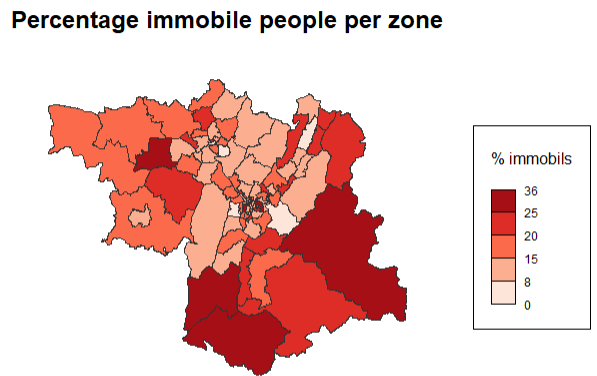
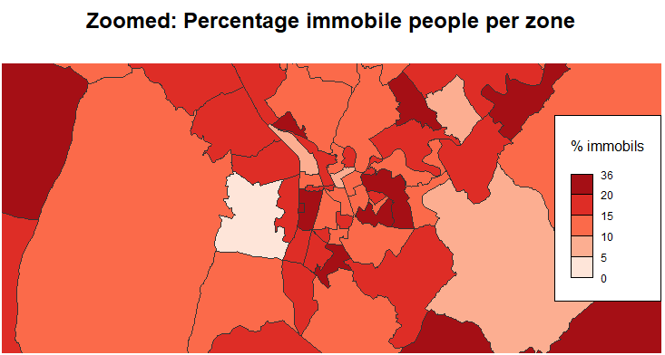
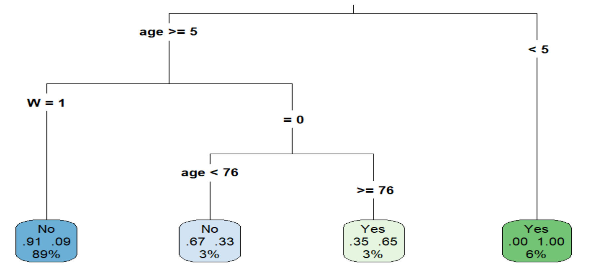
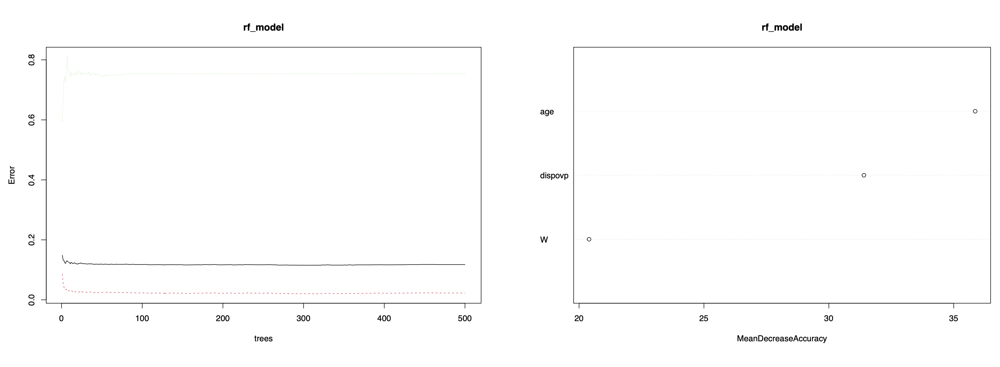
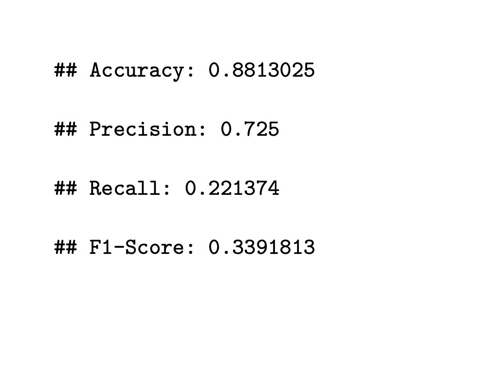

```{r setup-report, include=FALSE}
knitr::opts_chunk$set(echo = FALSE)
library(ggplot2)     # For data visualization
library(dplyr)       # For data manipulation (e.g., mutate, rename)
library(tidyr)       # For data tidying (e.g., handling missing values)
library(skimr) 
library(caTools)
library(pROC)
library(officer)

```

# Introduction
Mobility plays a very important role in society and can be a huge inconvenience. People can be immobile for a lot of reasons. In this project, it will be researched what characterizes immobile people in and around Grenoble and these people will be predicted based on certain variables. Several different models will be used to see which model is most suited to predict. This research can be useful for trying to decrease immobility. The following research questions are posed:
- How are immobile people characterized?
- Which model can best predict their immobility?

# Literature Review
Some literature was reviewed to determine the relevant variables and get some more insight in mobility data.

Paper 1: The spatial dimensions of immobility in France
In this paper, immobility is defined as not leaving your house. Structural Equation Modelling was used to declare immobility. The used variables were either social like retirement, income and car ownership, spacial like population density and region and individual like age, physical limitations, and education. It was concluded that social, spacial and individual variables all have a significant impact on the mobility of people in France.

Paper 2: Determinants of car ownership among young households in the Netherlands
Households from 18-29 years are researched to see what influences whether they have a car or not. Logistic regression was used to declare this variable using the grade of urbanization, age, ethnicity, family structure and income. The paper concludes that the decreasing possession of a car can be partially declared by the growing urbanization.

Paper 3: Modelling car ownership in urban areas: a case study of Hamilton, Canada
An online survey and a GIS was used to collect data. Then, multinomial logit modelling was used to predict the likelihood of car ownership. Household structure, income, income, working status, population density and proximity to and accessibility for facilities turned out to be the most relevant variables.

It can be seen that in all papers social, spacial and individual variables have a significant impact. Logit modelling seems to be a good way of investigating these variables and their interactions among themselves. 

## Variables Choice
Based on the reviewed literature, the following variables are chosen to be further researched: age, gender, type of living space, socio professional category, occupation, retirement, work from home, car ownership, number of cars, parking difficulty, living region and finally, a variable W is created. This variable is defined as whether a person has a direct mean of transport.

# Dataset Preparation
Since variables from all datasets are being used, these all needed to be merged. Then, these variables were selected, categorized, renamed and if necessary redefined. The W variable was also defined: if Nb_2Rm, Nb_velo, dispovp, ABO_TC, abonpeage and LIEU_STAT are all 0, then W is 1. Some variables have a lot of categories so these needed to be grouped. To decide on how to group these, a decision tree was used. This is how the variables age_grouped, OCCU1_grouped, TYPE_HAB and csp_grouped were defined. The following tree was used. Then, variables were iteratively removed from the tree to group variables that are not shown on the tree yet. Age is split in 0-5, 5-76 and 76+. Csp is (mostly) split in active working people and inactive people, scholars or interns. OCCU1 is split up in 3 groups: 1. working and stay-at-home, 2. students and interns, 3. inactive and retired. Homes are split between individual homes and collectives.
```{r child=("Starting-Decision-Tree.Rmd"), echo=TRUE}

```
This results in the following dataset. This is the dataset that will be used for all further analysis. (except for the GIS)
Most variable names speak for themselves. Parking_diff stands for parking difficulty. Fullygrouped is the sort of region a person lives in, divided in 3 levels: city, mountains and countryside. It is clear that plenty social, individual and spatial variables are in this dataset.
```{r child=("Data_manip_report.Rmd"), echo=TRUE}

```

# Data exploration
In this section, some further exploring of the data will be done to identify patterns, with a focus on the variables mentioned in the assignment.
Below are the distribution of W and immobil. It turns out that around 85% of people are mobile. Noticeably, the distribution of W is similar. In the third plot we can see that around half of the people that have no mean of travel are immobile. So, whether or not a person has a direct mean of transport has a big influence on a persons mobility.
```{r child=("Data exploration_report.Rmd"), echo=TRUE}

```
## Mapping
The following map shows the percentage immobile people per zone in and around Grenoble. This confirms the earlier conclusion that the sort of region a person lives in does not necessarily affect their mobility. Since, people living in the Chartreuse mountain region seem to be rather mobile, while some people in Grenoble are immobile. It is also noticable that people living in the Belledonne region are less mobile than people in the Chartreuse region, so the mobility does not necessarily depend on the sort of geologic region, but more so on different factors.

{width=50%}


{width=50%} 

# Modeling
In this section, 4 different models will be used to do further research in mobility and will be compared to one another and a benchmark model to see which model is most suited for predicting in this context. The same 3 declaring variables will be used to declare for each model: age_grouped, dispovp and W.
The models that will be used are: logistic regression, decision trees, random forest and neural networks.

## Logit model
As seen in the literature, the logit model is a good model to do some analysis on the different variables. After testing each selected variable in a separate model, it is concluded that every one of them is significant in this separate model. However, when putting them all together in a model, they are no longer significant. They least significant variable gets iteratively removed in the following order to reduce multicollinearity and achieve a model with only significant variables left: dispovp, sexe, fullygrouped, parking_diff, retrait. This leaves only significant variables in the model. This gives us an idea of which variables have the biggest influence. In a multivariate model like this, it is possible that a very significant variable becomes redundant, because another variable has a similar effect. It makes sense that dispovp was the least significant, since W is still in the model. Apparently, the influence of the gender of a person is not that big of an influence. As concluded earlier with the map and chisquared, the region a person lives in does also not necessarily influence their mobility. Parking difficulty probably has some overlap with W and retrait has some overlap with OCCU1 and csp.

The resulting model is shown below. The model has a McFadden's R-squared of 0.71. This is on the higher side. With an AIC of 2036.9, the model seems to have a good balance between fit and complexity. The difference between residual and null deviance shows that the model improves significantly with the chosen variables.
The baseline odds (intercept) show that the chance for immobility is lower than mobility. People over the age of 76 have an about 250% higher chance of being immobile. People that are non working have 146% higher odds of immobility than working people. People having a car have an 82% lower chance of being immobile. People living in a collective building have a 29% lower chance of immobility. Students and interns have a 327% higher chance of being immobile than the reference group, active working people. This is likely partly due to children being included in this group. Finally, having a direct mean of transport decreases chances of immobility by 78%.
It should be noted that these numbers should be taken with a grain of salt, since only 3236 observations are taken into account. So, these odds ratios are in a pretty wide confidence interval. But, they give a good idea of the influence of these variables.
```{r child=("Logit model_report.Rmd"), echo=TRUE}

```


## Decision tree

{width=50%}


```{r child=("DecisionTree3-Version2_report.Rmd"), echo=TRUE}

```

## Random forest 
{width=50%}

{width=50%}


## Clustering


## Neural network
{width=60%}

```


# Results

```{r, echo=FALSE}
# Erstellen Sie die Datenrahmen-Tabelle in R
model_performance <- data.frame(
  Model = c("Logit Model", "Decision tree", "Random Forest", "Neural Network1", "Neural Network2"),
  Accuracy = c(0.884, 0.900, 0.881, 0.900, 0.954),
  Precision = c(0.525, 0.450, 0.725, 0.926, 0.700),
  Recall = c(0.432, 0.870 , 0.221, 0.384, 0.233),
  F_score = c(0.474, 0.590 , 0.339, 0.543, 0.350)
)

# Ausgabe der Tabelle
model_performance
```


