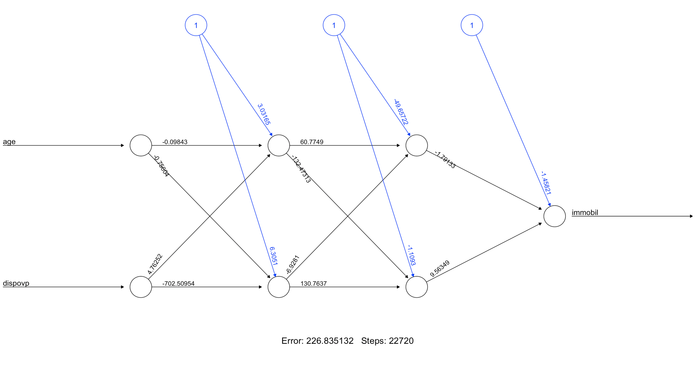

```{r setup-report, include=FALSE}
knitr::opts_chunk$set(echo = FALSE)
library(ggplot2)     # For data visualization
library(dplyr)       # For data manipulation (e.g., mutate, rename)
library(tidyr)       # For data tidying (e.g., handling missing values)
library(skimr) 
library(caTools)
library(pROC)
library(officer)

```

# Introduction

Discuss the research objectives and question:

- How are immobile people characterized?
- Which model can best predict their immobility?

---

# Literature Review
## Variables Identified

- From literature: Age, working status, health, sex, income, possession of a car, etc.
- From common sense: Remote work, bike or motorcycle ownership, distance to public transport.

#Data manipulation

---


## Dataset Preparation
```{r child=("Data_manip_report.Rmd"), echo=TRUE}

```


# Data exploration
## Mapping
{width=50%}


{width=50%} 

# Modeling
## Logit model
```{r child=("Logit model_report.Rmd"), echo=TRUE}

```


## Decision tree

{width=50%}


```{r child=("DecisionTree3-Version2_report.Rmd"), echo=TRUE}

```

## Random forest 
{width=50%}

{width=50%}


## Clustering

```{r child=("Clustering_v2_report.Rmd"), echo=TRUE}

```


## Neural network
{width=60%}
```{r child=("NN_v3_report.Rmd"), echo=TRUE}

```


# Results

```{r, echo=FALSE}
# Erstellen Sie die Datenrahmen-Tabelle in R
model_performance <- data.frame(
  Model = c("Logit Model", "Decision tree", "Random Forest", "Neural Network1", "Neural Network2"),
  Accuracy = c(0.884, 0.900, 0.881, 0.900, 0.954),
  Precision = c(0.525, 0.450, 0.725, 0.926, 0.700),
  Recall = c(0.432, 0.870 , 0.221, 0.384, 0.233),
  F_score = c(0.474, 0.590 , 0.339, 0.543, 0.350)
)

# Ausgabe der Tabelle
model_performance
```


