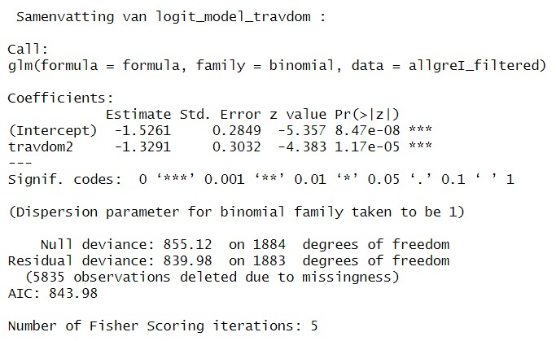

\titlepage


```{r setup-report, include=FALSE}
knitr::opts_chunk$set(echo = FALSE)
library(ggplot2)     # For data visualization
library(dplyr)       # For data manipulation (e.g., mutate, rename)
library(tidyr)       # For data tidying (e.g., handling missing values)
library(skimr) 
library(caTools)
library(pROC)
library(officer)

```

# Introduction
Mobility plays a very important role in society and can be a huge inconvenience. People can be immobile for a lot of reasons. In this project, it will be researched what characterizes immobile people in and around Grenoble and these people will be predicted based on certain variables. Several different models will be used to see which model is most suited to predict. This research can be useful for trying to decrease immobility. The following research questions are posed:
- How are immobile people characterized?
- Which model can best predict their immobility?

# Literature Review
Some literature was reviewed to determine the relevant variables and get some more insight in mobility data.

Paper 1: The spatial dimensions of immobility in France
In this paper, immobility is defined as not leaving your house. Structural Equation Modelling was used to declare immobility. The used variables were either social like retirement, income and car ownership, spacial like population density and region and individual like age, physical limitations, and education. It was concluded that social, spacial and individual variables all have a significant impact on the mobility of people in France.

Paper 2: Determinants of car ownership among young households in the Netherlands
Households from 18-29 years are researched to see what influences whether they have a car or not. Logistic regression was used to declare this variable using the grade of urbanization, age, ethnicity, family structure and income. The paper concludes that the decreasing possession of a car can be partially declared by the growing urbanization.

Paper 3: Modelling car ownership in urban areas: a case study of Hamilton, Canada
An online survey and a GIS was used to collect data. Then, multinomial logit modelling was used to predict the likelihood of car ownership. Household structure, income, income, working status, population density and proximity to and accessibility for facilities turned out to be the most relevant variables.

It can be seen that in all papers social, spacial and individual variables have a significant impact. Logit modelling seems to be a good way of investigating these variables and their interactions among themselves. 

## Variables Choice
Based on the reviewed literature, the following variables are chosen to be further researched: age, gender, type of living space, socio professional category, occupation, retirement, work from home, car ownership, number of cars, parking difficulty, living region and finally, a variable W is created. This variable is defined as whether a person has a direct mean of transport.

# Dataset Preparation
Since variables from all datasets are being used, these all needed to be merged. Then, these variables were selected, categorized, renamed and if necessary redefined. The W variable was also defined: if Nb_2Rm, Nb_velo, dispovp, ABO_TC, abonpeage and LIEU_STAT are all 0, then W is 1. Some variables have a lot of categories so these needed to be grouped. To decide on how to group these, a decision tree was used. This is how the variables age_grouped, OCCU1_grouped, TYPE_HAB and csp_grouped were defined. The following tree was used. Then, variables were iteratively removed from the tree to group variables that are not shown on the tree yet. Age is split in 0-5, 5-76 and 76+. Csp is (mostly) split in active working people and inactive people, scholars or interns. OCCU1 is split up in 3 groups: 1. working and stay-at-home, 2. students and interns, 3. inactive and retired. Homes are split between individual homes and collectives.
```{r child=("Starting-Decision-Tree.Rmd"), echo=TRUE}

```
\justifying
This results in the following dataset. This is the dataset that will be used for all further analysis. (except for the GIS)
Most variable names speak for themselves. Parking_diff stands for parking difficulty. Fullygrouped is the sort of region a person lives in, divided in 3 levels: city, mountains and countryside. It is clear that plenty social, individual and spatial variables are in this dataset.
```{r child=("Data_manip_report.Rmd"), echo=TRUE}

```
\justifying
# Data exploration
\normalsize
In this section, some further exploring of the data will be done to identify patterns, with a focus on the variables mentioned in the assignment.
Below are the distribution of W and immobil. It turns out that around 85% of people are mobile. Noticeably, the distribution of W is similar. In the third plot we can see that around half of the people that have no mean of travel are immobile. So, whether or not a person has a direct mean of transport has a big influence on a persons mobility.
```{r child=("Data exploration_report.Rmd"), echo=TRUE}

```

## Mapping
\justifying
\normalsize
The following map shows the percentage immobile people per zone in and around Grenoble. This confirms the earlier conclusion that the sort of region a person lives in does not necessarily affect their mobility. Since, people living in the Chartreuse mountain region seem to be rather mobile, while some people in Grenoble are immobile. It is also noticable that people living in the Belledonne region are less mobile than people in the Chartreuse region, so the mobility does not necessarily depend on the sort of geologic region, but more so on different factors.

```{r, echo=FALSE, out.width="50%", fig.align="default", fig.show="hold"}
knitr::include_graphics(c("image.png", "image-2.png"))

```

# Modeling
\justifying
In this section, 4 different models will be used to do further research in mobility and will be compared to one another and a benchmark model to see which model is most suited for predicting in this context. The same 3 declaring variables will be used to declare for each model: age_grouped, dispovp and W.
The models that will be used are: logistic regression, decision trees, random forest and neural networks.

## Logit model
As seen in the literature, the logit model is a good model to do some analysis on the different variables. After testing each selected variable in a separate model, it is concluded that every one of them is significant in this separate model. However, when putting them all together in a model, they are no longer significant. They least significant variable gets iteratively removed in the following order to reduce multicollinearity and achieve a model with only significant variables left: dispovp, sexe, fullygrouped, parking_diff, retrait. This leaves only significant variables in the model. This gives us an idea of which variables have the biggest influence. In a multivariate model like this, it is possible that a very significant variable becomes redundant, because another variable has a similar effect. It makes sense that dispovp was the least significant, since W is still in the model. Apparently, the influence of the gender of a person is not that big of an influence. As concluded earlier with the map and chisquared, the region a person lives in does also not necessarily influence their mobility. Parking difficulty probably has some overlap with W and retrait has some overlap with OCCU1 and csp.

The resulting model is shown below. The model has a McFadden's R-squared of 0.71. This is on the higher side. With an AIC of 2036.9, the model seems to have a good balance between fit and complexity. The difference between residual and null deviance shows that the model improves significantly with the chosen variables.
The baseline odds (intercept) show that the chance for immobility is lower than mobility. People over the age of 76 have an about 250% higher chance of being immobile. People that are non working have 146% higher odds of immobility than working people. People having a car have an 82% lower chance of being immobile. People living in a collective building have a 29% lower chance of immobility. Students and interns have a 327% higher chance of being immobile than the reference group, active working people. This is likely partly due to children being included in this group. Finally, having a direct mean of transport decreases chances of immobility by 78%.
It should be noted that these numbers should be taken with a grain of salt, since only 3236 observations are taken into account. So, these odds ratios are in a pretty wide confidence interval. But, they give a good idea of the influence of these variables.
```{r child=("Logit model_report.Rmd"), echo=TRUE}

```


## Decision tree

```{r child=("DecisionTree2.Rmd"), echo=TRUE}

```
\justifying
\normalsize
We trained Decision Trees using the explanatory variables age, dispovp, and the focus variable W to predict the target variable "immobil." We constructed one Decision Tree using the numerical variable age and another with the categorized variable age_group, alongside the variables W and dispovp. Age emerged as the most significant predictor of immobility, and this approach aimed to confirm the superior performance of these categories.
To compare performance, we built a third model using the variables has_car, OCCU1, and W. These were chosen because has_car and OCCU1 were highly significant in logistic regressions, consistently performed well in earlier regression models, and are supported in the literature as strong predictors of immobility.
When comparing the evaluation metrics of the three trees, the third model lacks defined Recall and F1-Score values, as it classified all observations as "mobile." This outcome results from the imbalanced dataset, where False Negatives are absent. Accuracy, as expected, is high in such cases but misleading. To preserve the dataset's balance, children under 5 were retained despite their marginal contribution to classification.
Trees 1 and 2 outperform Tree 3, demonstrating that these explanatory variables are more effective for predicting immobility.
When examining Trees 1 and 2, we observe that, as mentioned, the Accuracy value is favorable. The F1-Score, which equally balances the importance of the majority and minority classes, is 0.59 for both models, indicating a moderate balance between precision and recall. This consistency arises because the split thresholds for age align closely with the boundaries of age_group. The highly similar evaluation metrics further confirm that the chosen age categorization was appropriate. Compared to earlier models, these trees offer only marginal improvements but excel in simplicity. On the test data, they perform equally well while being easier to interpret.
```{r child=("DecisionTree3-Version2_report.Rmd"), echo=TRUE}

```

```{r child=("DecisionTree4.Rmd"), echo=TRUE}

```

\raggedright
## Random forest 
\justifying
\normalsize
A Random Forest was trained using age, dispovp, and W, with age chosen as the representative variable since it performs similarly to age_group in the models. Both models perform equally well, so age was selected for simplicity. The performance is summarized in two diagrams. The first shows how the model’s error changes with the number of trees. The error quickly decreases and stabilizes after 50–100 trees, indicating that enough trees have been added to make robust predictions. Class-specific errors reveal challenges with the minority class, likely due to dataset imbalance, indicating that the issue lies more in the data than the model parameters.
The second diagram shows variable importance, with age being the most influential predictor. dispovp gains more importance than in Decision Trees, as Random Forests use different subsets of variables. Surprisingly, observing the evaluation metrics the Random Forest performs worse than the Decision Tree, very likely due to its lower performance with imbalanced datasets.

```{r child=("RandomForest.Rmd"), echo=TRUE}

```

## Clustering
\justifying
\normalsize
Experiments were made with K-means clustering to see if it could provide us with meaningful groups for individuals based on the variables of interest. Two seperate set of clusters were made with different sets of variables. Clustering 1 used age_group, cspgroup, W, OCCU1, travdom and dispovp. Clustering 2 used age_group, dispovp and W. Categorical variables are converted to numeric since K-means clustering only works for numerical variables. We chose to give missing values the mean of the column and lastly we normalize the numerical variables for better results. Elbow plots and experimentation with different numbers of clusters was used and 3 clusters were chosen as a best fit for this data based on the elbow plots and exploration of cluster evaluations.

```{r child=("Clustering_v2_report.Rmd"), echo=TRUE} 

```

\raggedright
## Neural network
\justifying
\normalsize
A neural network (NN) was utilized to see how well it could predict the mobility status of individuals compared to other models. Three seperate NN´s were made with different numbers of variables utilized. In NN1 only age and dispovp are used as numeric variables. NN2 uses age, dispovp, W, cspgroup, OCCU1 and travdom. NN3 uses age_group, dispovp and W. All of them were trying to predict the value of immobil as a number between 0-1 as immobil was changed to a numeric variable in the training. When predictions are made a threshold of 0,5 is used to determine if the prediction falls into 0 or 1 for immobility. All networks used a structure with 2 nodes and 2 hidden layers, linear.output is set to false as we are dealing with a classification problem, training and test data was split 70/30, a stepmax of 100.000 was used and all networkes were able to converge. 
NA values were omitted were necessary and one-hot encoding was used for the categorical variables. Further experiments were made by trying to omitt less of NA values by either creating new categories for such variables or setting them to the average value but these experiments did not improve our model. Oversampling was also tested to try to balance the data but it did not seem to improve the model either. The model that uses only age and dispovp had the best performance in our experiments.

\centering
{width=90%}

```{r child=("NN_v3_report.Rmd"), echo=TRUE}

```


\raggedright
# Conclusion
\justifying
\normalsize
As could be expected from the literature review, immobile people in Grenoble are characterized through various factors. The most significant determinants were concluded to be the ownership of a car, having a direct mean of transport and the age group a person belongs too. The occupation or socio professional class a person belongs too also seems to have a big influence. The sort of region a person lives in does not necessarily have a big influence on their mobility.

4 models were tested on the same dataset, with the same declaring variables, to see which would be the best fit to make predictions for the immobile people in and around Grenoble. The evaluation metrics of these models can be seen below. The logit model and random forest boast the weakest results. Both having a decent accuracy, but suffering from low recall, meaning that the model does not often predict a person to be immobile. For the logit model, this is because it does not sufficiently take the minority class into account. The ensemble of trees in the random forest also doesn’t sufficiently prioritize the minority class. Both neural networks boast a good accuracy with an average F-score. The predictions seem to be very accurate and when it predicts a person to be immobile, it is fairly precise. But, the problem is that these networks do not predict people to be immobile very often. There also seems to be a trade-off, the more variables get added, the higher the accuracy and prediction of the model, but the lower the recall. (Since NN2 has more predicting variables than NN1). In this case, the NN1 seems to be the better option of the 2, since it deals with the minority class in a better way. The decision tree seems to perform the best. This is the only model that has a good recall. While the precision could still be improved upon, this model seems to work the best for dealing with the unbalanced variable.

The results are overall not surprising and reflect the known properties of the models: while the decision tree stands out for its high recall, the random forest, logit model and neural network fail to sufficiently identify the minority class despite their theoretical strengths (robustness and pattern recognition, respectively). Nevertheless, measures such as improving class weighting or adjusting thresholds could further optimize overall performance and thus improve the balance between the different evaluation metrics.

\normalsize
```{r, echo=FALSE}
# Erstellen Sie die Datenrahmen-Tabelle in R
model_performance <- data.frame(
  Model = c("Logit Model", "Decision tree", "Random Forest", "Neural Network1", "Neural Network2"),
  Accuracy = c(0.869, 0.910, 0.881, 0.900, 0.954),
  Precision = c(0.441, 0.440, 0.725, 0.926, 0.700),
  Recall = c(0.434, 0.900 , 0.221, 0.384, 0.233),
  F_score = c(0.438, 0.590 , 0.339, 0.543, 0.350)
)

# Ausgabe der Tabelle
model_performance
```

\newpage
# References
\justifying
\normalsize
Potoglou, D. & Kanaroglou, P. S. (2007). Modelling car ownership in urban areas: a case study of Hamilton, Canada. Journal Of Transport Geography, 16(1), 42–54. https://doi.org/10.1016/j.jtrangeo.2007.01.006

Motte-Baumvol, B., & Bonin, O. (2017). The spatial dimensions of immobility in France. Transportation, 1231–1247. https://doi.org/10.1007/s11116-017-9763-5 

Oakil, A. T. M., Manting, D. & Nijland, H. (2016). Determinants of car ownership among young households in the Netherlands: The role of urbanisation and demographic and economic characteristics. Journal Of Transport Geography, 51, 229–235. https://doi.org/10.1016/j.jtrangeo.2016.01.010

\newpage
# Appendix
\justifying
\normalsize

## Data exploration
```{r, echo=FALSE, out.width="50%", fig.align="default", fig.show="hold"}
knitr::include_graphics(c("appendix1.jpeg", "appendix2.jpeg"))
knitr::include_graphics(c("appendix3.jpeg", "appendix4.jpeg"))
knitr::include_graphics(c("appendix5.jpeg", "appendix6.jpeg"))
knitr::include_graphics(c("appendix7.jpeg", "appendix8.jpeg"))
knitr::include_graphics(c("appendix9.jpeg", "appendix10.jpeg"))
knitr::include_graphics(c("appendix11.jpeg", "appendix12.jpeg"))
```

## Logit model
{width=70%}  
{width=70%}  
{width=70%}  
{width=70%}  
{width=70%}  
{width=70%}  
{width=70%}  
{width=70%}  
{width=70%}  
{width=70%}  
{width=70%}


